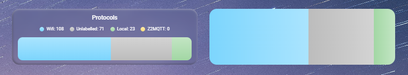
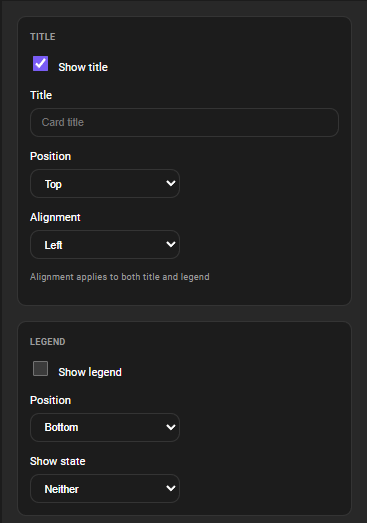
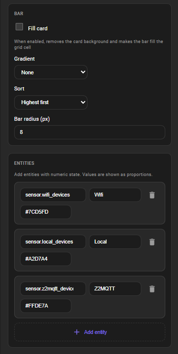
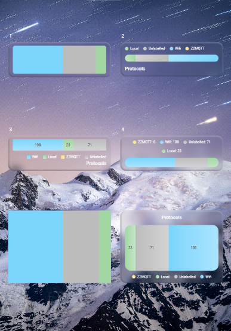
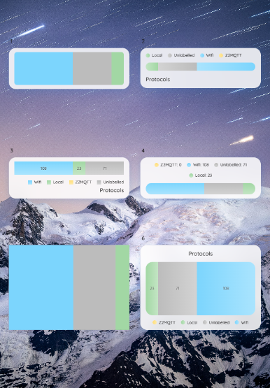
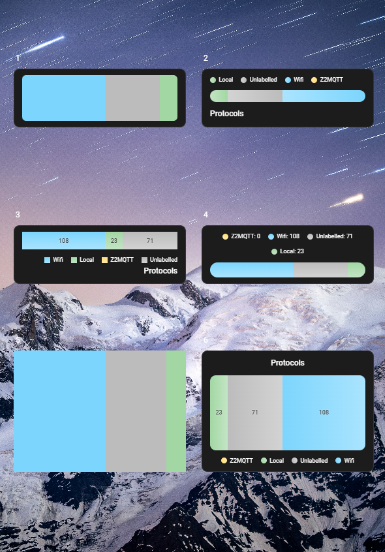

# Stacked Horizontal Bar Card

A Home Assistant Lovelace card that displays a horizontal stacked bar — like a pie chart in a line. Each segment represents an entity's numeric value with configurable colors, gradients, and ordering.



## Installation

<details>
<summary style="font-size: 1.75em; font-weight: 600;"><strong>HACS (recommended)</strong></summary>

1. Open HACS
2. Click the three dots in the top right, then 'Custom repositories'
3. Paste `https://github.com/kattcrazy/Stacked-Horizontal-Bar-Card` and select "Dashboard"
4. Search for 'Stacked Horizontal Bar Card' in HACS and download
5. Reload your page!

</details>

<details>
<summary style="font-size: 1.75em; font-weight: 600;"><strong>Manual</strong></summary>

1. Download `stacked-horizontal-bar-card.js` from the [releases](https://github.com/kattcrazy/Stacked-Horizontal-Bar-Card/releases) page
2. Place it in your `config/www/` folder
3. Add the resource in the Lovelace config:
```yaml
resources:
  - url: /local/stacked-horizontal-bar-card.js
    type: module
```
4. Refresh your dashboard or Home Assistant if needed

</details>

## Configuration

### Card options

All options support Jinja templates (strings containing `{{ }}`).

| Option | Type | Default | Description |
|--------|------|---------|-------------|
| `alignment` | `left`, `center`, `right` | `left` | Horizontal alignment for both title and legend |
| `show_title` | boolean | `true` | Show title |
| `title` | string | — | Card title text |
| `title_position` | `top`, `bottom` | `top` | Title placement |
| `show_legend` | boolean | `true` | Show legend with labels |
| `legend_show_zero` | boolean | `true` | Include entities with 0 value in legend |
| `legend_position` | `top`, `bottom` | `bottom` | Legend placement |
| `show_state` | `bar`, `legend`, `both`, `none` | `legend` | Where to show entity values |
| `sort` | `abc`, `cba`, `highest`, `lowest`, `custom` | `highest` | Segment order (left → right) |
| `bar_radius` | number | theme | Bar segment border-radius (px); omit for theme default |
| `gradient` | `none`, `left`, `right`, `center`, `top`, `bottom` | `none` | Gradient direction |
| `fill_card` | boolean | `false` | Remove card background; bar fills grid cell; hides title/legend |
| `entities` | array | `[]` | Entity list (see below) |

### Entity options

| Option | Type | Default | Description |
|--------|------|---------|-------------|
| `entity` | string | required | Entity ID (e.g. `sensor.battery_level`) or Jinja template (e.g. `"{{states('sensor.battery_level')}}) |
| `name` | string | — | Override name; omit to use friendly name. Supports Jinja. |
| `color` | string | auto | Hex (e.g. `#FF0000`) or HA variable. Supports Jinja. |
| `order` | number | — | Used when `sort: custom`. Supports Jinja. |

Entities must have numeric values (from entity state or from a Jinja template in `entity`). Proportions are computed from the sum.

<details>
<summary style="font-size: 1.75em; font-weight: 600;"><strong>UI config</strong></summary>

<p></p>
<p></p>

</details>


### Full config with all options
For your copy-paste convenience!

```yaml
type: custom:stacked-horizontal-bar-card

alignment: left/center/right
show_title: true/false
title: Energy Usage
title_position: top/bottom

show_legend: true/false
legend_show_zero: true/false
legend_position: top/bottom

show_state: legend/bar/both/none

sort: abc/cba/highest/lowest/custom

bar_radius: 8                # omit for theme default
gradient: none/left/right/center/top/bottom
fill_card: true/false

entities:
  - entity: sensor.grid_usage  # Or use Jinja templating
    name: Grid
    color: '#4472C4'
    order: 1
 

```

## Config Examples

  

<details>
<summary style="font-size: 1.75em; font-weight: 600;"><strong>Communication Protocols</strong></summary>

```yaml
type: custom:stacked-horizontal-bar-card
show_legend: true
show_state: legend
sort: highest
bar_height: auto
entities:
  - entity: sensor.wifi_devices # Your entity here
    name: Wifi
    gradient: true
    color: "#7CD5FD"
  - entity: sensor.local_devices # Your entity here
    name: Local
    gradient: true
    color: "#A2D7A4"
  - entity: sensor.z2mqtt_devices # Your entity here
    gradient: true
    color: "#FFDE7A"
    name: Z2MQTT
legend_position: top
title_position: top
gradient: bottom
title: Protocols
grid_options:
  columns: 12
  rows: 2.5
fill_card: false
show_title: true
alignment: center
bar_radius: 13

```

Here's the configuration code used to get the sensors in the example above. It uses the labels assigned to devices.

```yaml

template:
  - sensor:
      - name: Z2MQTT Devices
        state: "{{ label_devices('Z2MQTT') | count }}"

      - name: Local Devices
        state: "{{ label_devices('Local') | count }}"

      - name: WIFI Devices
        state: "{{ label_devices('WIFI') | count }}"

      - name: Unlabelled Devices
        state: >
          {{
            states('sensor.devices') | int
            - states('sensor.z2mqtt_devices') | int
            - states('sensor.local_devices') | int
            - states('sensor.wifi_devices') | int
          }}

```

</details>

<details>
<summary style="font-size: 1.75em; font-weight: 600;"><strong>Progress Bar</strong></summary>

```yaml
type: custom:stacked-horizontal-bar-card
entities:
  - entity: "{{ states('sensor.percent_finished') | float }}" # Your entity here
    name: Completed
    color: '#7DD3FC'  
    order: 1
  - entity: "{{ 100 - states('sensor.percent_finished') | float }}" # Your entity here
    name: Remaining
    color: '#E0E0E0' # Paler version of chosen colour here
    order: 2
show_legend: false
show_state: none
sort: custom
```

</details>

<details>
<summary style="font-size: 1.75em; font-weight: 600;"><strong>Storage usage</strong></summary>

```yaml
type: custom:stacked-horizontal-bar-card
title:  Storage
entities:
  - entity: sensor.docker_homeassistant_memory # Your entity here
    name: Home Assistant
    color: "#7DD3FC"
  - entity: sensor.docker_nginx_memory # Your entity here
    name: Nginx
    color: "#86EFAC"
  - entity: sensor.docker_mosquitto_memory # Your entity here
    name: Mosquitto 
    color: "#D8B4FE"
  - entity: "{{ states('sensor.total_storage') | float - states('sensor.docker_homeassistant_memory') | float - states('sensor.docker_nginx_memory') | float - states('sensor.docker_mosquitto_memory') | float }}" # Your entities here, in the template
    name: Unused 
    color: "#D4D4D4"
sort: highest
show_state: bar
legend_show_zero: false
```

</details>

<details>
<summary style="font-size: 1.75em; font-weight: 600;"><strong>CPU usage</strong></summary>

```yaml
type: custom:stacked-horizontal-bar-card
title: CPU Usage
entities:
  - entity: sensor.docker_homeassistant_cpu # Your entity here
    name: Home Assistant
    color: "#7DD3FC"
  - entity: sensor.docker_nginx_cpu  # Your entity here
    name: Nginx
    color: "#86EFAC"
  - entity: sensor.docker_mosquitto_cpu # Your entity here
    name: Mosquitto
    color: "#D8B4FE"
sort: highest
show_state: bar
legend_show_zero: false
```

</details>


## About
This is my first Home Assistant card that I will be maintaining for public use. I have tested it on my own setup and it works perfectly! Please report an issue if something doesn't work, I'll try my best to fix it.

Support me [here](https://kattcrazy.nz/product/support-me/)
